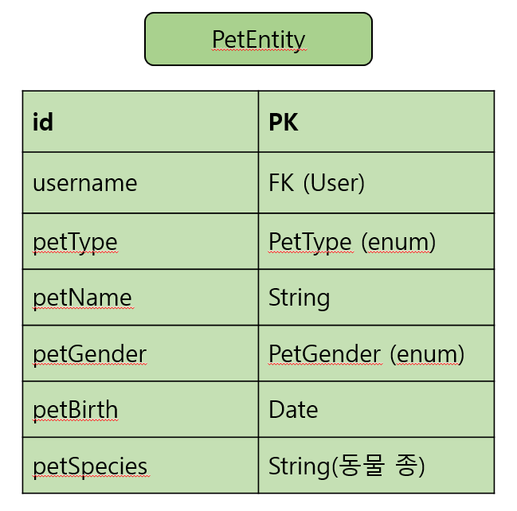
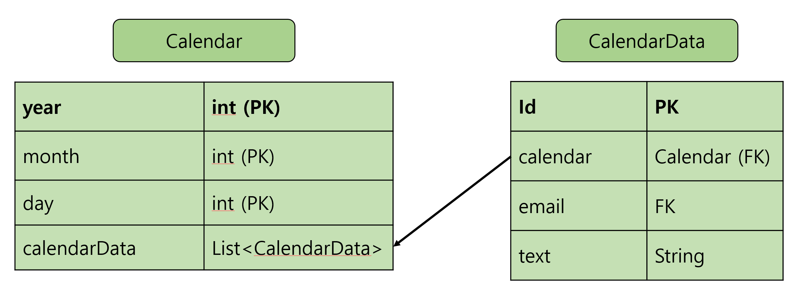

## Profile서비스

---
### 애완동물 정보 관리 기능

> getUserPet
> > User의 애완동물들 리턴
>
> add
> > 애완동물 추가
> 
> update
> > 토큰 얻어와서 유저 검사 후, pet id로 해당 애완동물 변경
> 
> deleteById
> > 토큰 얻어와서 유저 검사 후, pet id로 해당 애완동물 삭제

---
### 캘린더 기능

> getALL("/calendar?year={int}&month={int}")
> > 특정 년, 월에 대한 모든 Calendar와 CalendarData 가져오기
>
> addCalendarData -> RequestBody: CalendarDTO 참고
> > 바디에 있는 year, month, day 참고해서 해당 날짜에 일정 추가
> 
> 수정 미구현