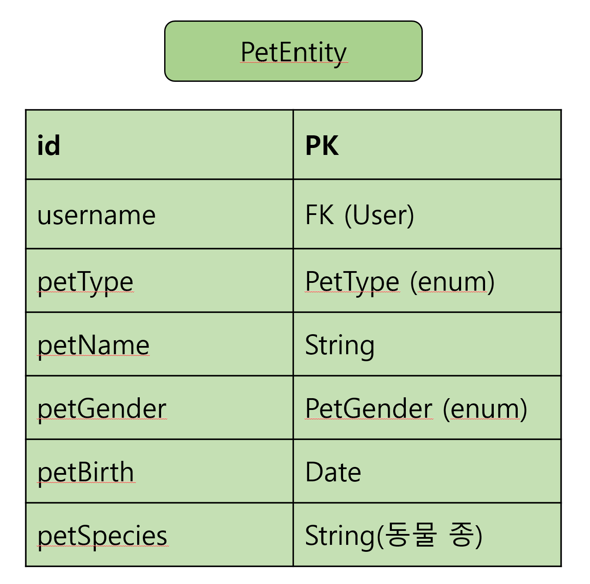
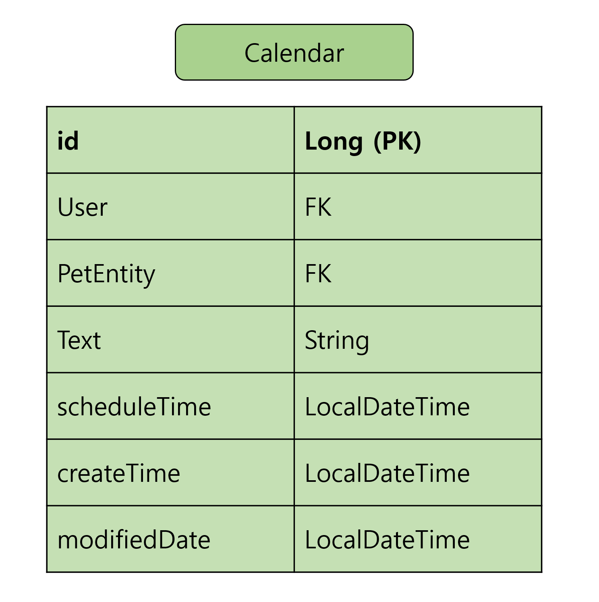

## Profile서비스

---
### 애완동물 정보 관리 기능

> getUserPet
> > User의 애완동물들 리턴
>
> add
> > 애완동물 추가
> 
> update
> > 토큰 얻어와서 유저 검사 후, pet id로 해당 애완동물 변경
> 
> deleteById
> > 토큰 얻어와서 유저 검사 후, pet id로 해당 애완동물 삭제

---
### 일정 관리 기능

> 제공 기능
> > getProfileSchedule : 금일 포함 앞으로의 일정들 최대 30개 리턴
> 
> > getSchedule : 선택된 날짜에 대한 일정들 리턴
> 
> > getMonthSechedule : 선택된 년도와 달의 일정들 리턴
> 
> > 이 외에 C,U,D 있음